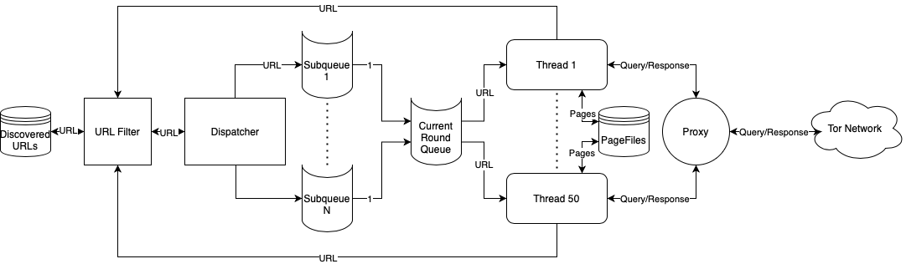
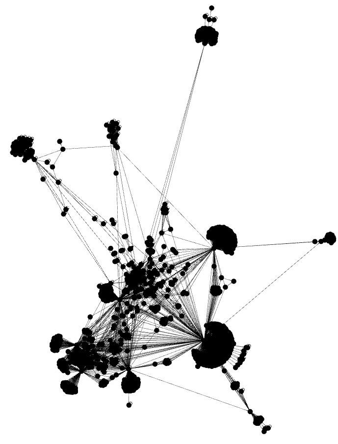

# CustomTorCrawler
This project presents a multi-threaded web crawler on the [Tor network](https://www.torproject.org) that was used to discover 500 000 onion domains and 6 million pages during a 2 month crawl.

On of it key characteristic is the use of a persistent queue that enables it to be stopped, and restarted from its previous state at any time as well as recover from an unexpected server crash.
To crawl pages requiring a login, previously generated cookies can be stored in the src/ressources/cookies.json file.

## Launch 
To run the crawler:

- Place the desired seed urls in the src/ressources/seeds.json file.
- Generate the uberjar:\
``` mvn clean compile assembly:single ```
- Launch Docker and run the Tor Proxy container:\
``` docker run -d -p 8118:8118 -p 2090:2090 -e tors=50 -e privoxy=1 --rm --name tor_proxy zeta0/alpine-tor ```
- Run the jar with the correct configurations *"restore/create" threadCount* :\
``` java -jar target/CustomCrawler-0.0.1-SNAPSHOT.jar create 10``` 

- To recover from a previous crawl, run the jar with "restore" as first parameter.

- The extractGraphFromData.py script can be used to build and save the graph of the crawl's data as well as extracting some key features of the topology of the network.

## Architecture

The main bottleneck in web crawling is the query latency for web pages. Due to its complicated protocol, the Tor network can reach a latency of 3s per query which makes multi-threading a necessity for efficient crawling. As a result, this crawler has a main thread dispatching the queries to n worker threads which in turn load the webpages, store them in a thread-specific file and push the newly discovered URL's in a concurrent queue.
  


## Network access

To access the Tor network, the crawler sends its queries to a [Docker container](https://hub.docker.com/r/zeta0/alpine-tor/) running a load balancing proxy.

## Results

Running the crawl for 2 months on a dedicated server lead to the discovery of 500 000 .onion domains and 6 million pages. From a sample of those domains, a network graph could be generated. Due to limited time, only few features of the network have been extracted but more details about it can be found in the [Report](BachelorReport/BachelorReport.pdf) file.  



## Technologies 
- Open JDK 11
- Docker 
- Gson
- JSoup
- [square/tape](https://github.com/square/tape)
